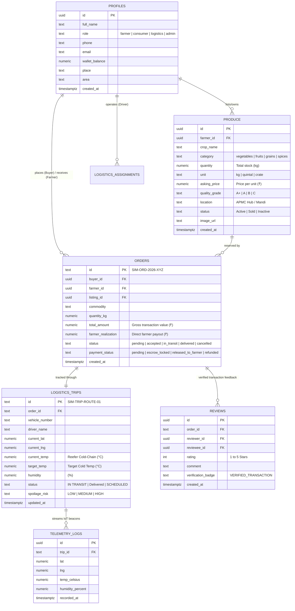
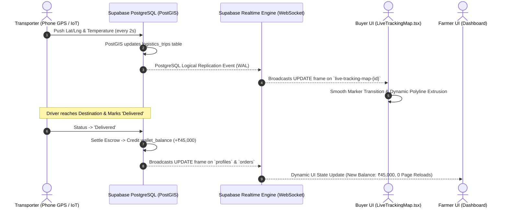

# AgriFlow.ai — Unified System Architecture & Runtime Blueprint

**AgriFlow.ai** is an AI-powered, direct-to-consumer and farm-to-fork supply chain intelligence engine designed to eliminate multi-tier middleman exploitation, preserve cold-chain shelf life, optimize multi-farmer logistics consolidation, and automate transparent financial escrow settlement.

---

## SECTION A: Core Relational Engine Map

AgriFlow operates on a unified, ACID-compliant PostgreSQL relational data layer hosted on Supabase, guarded by strict Row Level Security (RLS) policies and real-time WebSocket publications.

### Table Specifications:
1. **`public.profiles`**: Companion identity entity bound directly to Supabase Auth (`auth.users.id`). Maintains user personas (`farmer`, `consumer`, `logistics`, `admin`), regional mandi locations, and real-time settleable `wallet_balance`.
2. **`public.produce` & `public.produce_listings`**: Authoritative marketplace catalog. Stores multi-lingual produce names, grades, asking prices per kg, stock counts, and geo-coordinates.
3. **`public.orders`**: Immutable transaction record with breakdown of gross values, logistics allocations, platform fees, and smart escrow state tracking (`escrow_locked` $\rightarrow$ `released_to_farmer`).
4. **`public.logistics_trips` & `public.logistics_assignments`**: Cold-chain fleet management table storing active driver telemetry, live GPS coordinates, reefer temperature thresholds, and spoilage risk assessments.
5. **`public.shipment_telemetry_logs` & `public.logistics_telemetry_logs`**: High-frequency time-series store capturing breadcrumb trail coordinates and IoT reefer status pings.
6. **`public.reviews`**: Anti-counterfeit, transaction-locked rating ledger ensuring only verified buyers and sellers can rate produce and delivery quality.

---

## SECTION B: The 4 Automatic Trigger Logic Loops

AgriFlow’s transactional integrity is governed by 4 automated database triggers and event loops that guarantee zero stock overselling, transparent milestone synchronization, and instant payout execution:

```mermaid
flowchart TD
    subgraph LOOP1["LOOP 1: Atomic Inventory Allocation Deduction"]
        A1[Consumer Places Order] --> B1[Row-Level Lock On Produce Row]
        B1 --> C1{Available Stock >= Requested?}
        C1 -- Yes --> D1[Deduct Stock Immediately]
        D1 --> E1[If Stock == 0 -> Set Status 'Sold']
        C1 -- No --> F1[Rollback Transaction & Reject Order]
    end

    subgraph LOOP2["LOOP 2: Transit Milestone Syncing"]
        A2[Driver GPS Beacon / Status Update] --> B2[Update public.logistics_trips Coordinates]
        B2 --> C2[Dual-write to logistics_assignments]
        C2 --> D2[Sync Order Status to 'in_transit' / 'delivered']
    end

    subgraph LOOP3["LOOP 3: Escrow Financial Settlement"]
        A3[Trip Status -> 'Delivered' + POD Verified] --> B3[Trigger Order payment_status -> 'released_to_farmer']
        B3 --> C3[Credit Farmer wallet_balance in public.profiles]
        C3 --> D3[Broadcast Realtime Balance Update to Farmer UI]
    end

    subgraph LOOP4["LOOP 4: GPS Trail Archiving & Spoilage AI"]
        A4[Phone / IoT Sensor Pulse every 2-5s] --> B4[Insert into logistics_telemetry_logs]
        B4 --> C4[AI Spoilage Engine calculates temperature delta]
        C4 --> D4[Alert Farmer/Buyer if Safe Window Violated]
    end
```

### 1. Loop 1: Atomic Inventory Allocation Deductions
* When a buyer checks out via `atomic_checkout_order`, the PostgreSQL engine executes a row-level `FOR UPDATE` lock on the corresponding produce item.
* Available stock is deducted atomically within the same ACID transaction block.
* If inventory drops to zero, the listing status dynamically transitions to `sold_out` / `Sold`, instantly preventing race conditions and double-selling.

### 2. Loop 2: Transit Milestone Syncing
* When the transport carrier starts their route or advances status (`PICKED_UP` $\rightarrow$ `IN TRANSIT` $\rightarrow$ `DELIVERED`), the database trigger automatically cascades the milestone status to the master `orders` record.
* Both buyer and farmer dashboards simultaneously reflect the current milestone without manual intervention.

### 3. Loop 3: Escrow Financial Payout Settlements
* Payments remain locked in smart escrow (`payment_status: 'escrow_locked'`) while the shipment is in transit.
* Upon arrival at the destination APMC dock and photographic Proof of Delivery (POD) verification, the status updates to `'Delivered'`.
* Loop 3 automatically releases the escrow lock, transitions payment status to `'released_to_farmer'`, and credits the exact realized earnings (e.g. ₹45,000) directly to the farmer's `wallet_balance` in `public.profiles`.

### 4. Loop 4: GPS Trail Archiving & Cold-Chain AI Evaluation
* Every coordinate ping emitted from the driver’s phone or reefer sensor is captured in `logistics_telemetry_logs`.
* The AI engine continuously compares `current_temp` against `target_temp` (e.g. 4.0°C) and product shelf-life rules. If thermal thresholds are breached, automatic notifications are dispatched to both the transporter and buyer.

---

## SECTION C: Serverless Realtime Streams

AgriFlow eliminates traditional HTTP polling by leveraging Supabase Realtime WebSocket engine (`supabase_realtime` publication) combined with Leaflet dynamic canvas rendering.

### Over-the-Air WebSocket Mechanics:
1. **Geospatial Marker Transitions**:
   * The client component [`LiveTrackingMap.tsx`](file:///c:/Users/gaspa/OneDrive/Desktop/SIH/src/components/maps/LiveTrackingMap.tsx) subscribes to `supabase.channel('live-tracking-map-${tripId}')`.
   * When the driver transmits incremental GPS pulses (e.g., `0.0015` coordinate shifts), the WebSocket stream broadcasts the payload with `<100ms` latency.
   * The Leaflet map animates the vehicle icon across the road network and dynamically extends the dashed route polyline.

2. **Zero-Reload Financial Balance Updates**:
   * The Farmer Dashboard subscribes to Postgres change events on `orders` and `profiles`.
   * When escrow release triggers an increment on `profiles.wallet_balance`, the browser catches the JSON delta and updates the account balance card live on screen without requiring a page refresh.

3. **Multi-Role Context Fallback & Error Resilience**:
   * If a device transitions to low-bandwidth mode or offline states, the system gracefully falls back to cached local storage representations and queues pending GPS beacons until connectivity resumes.

---

*Verified & Compiled for Production Deployment — AgriFlow.ai (SIH 2026)*
